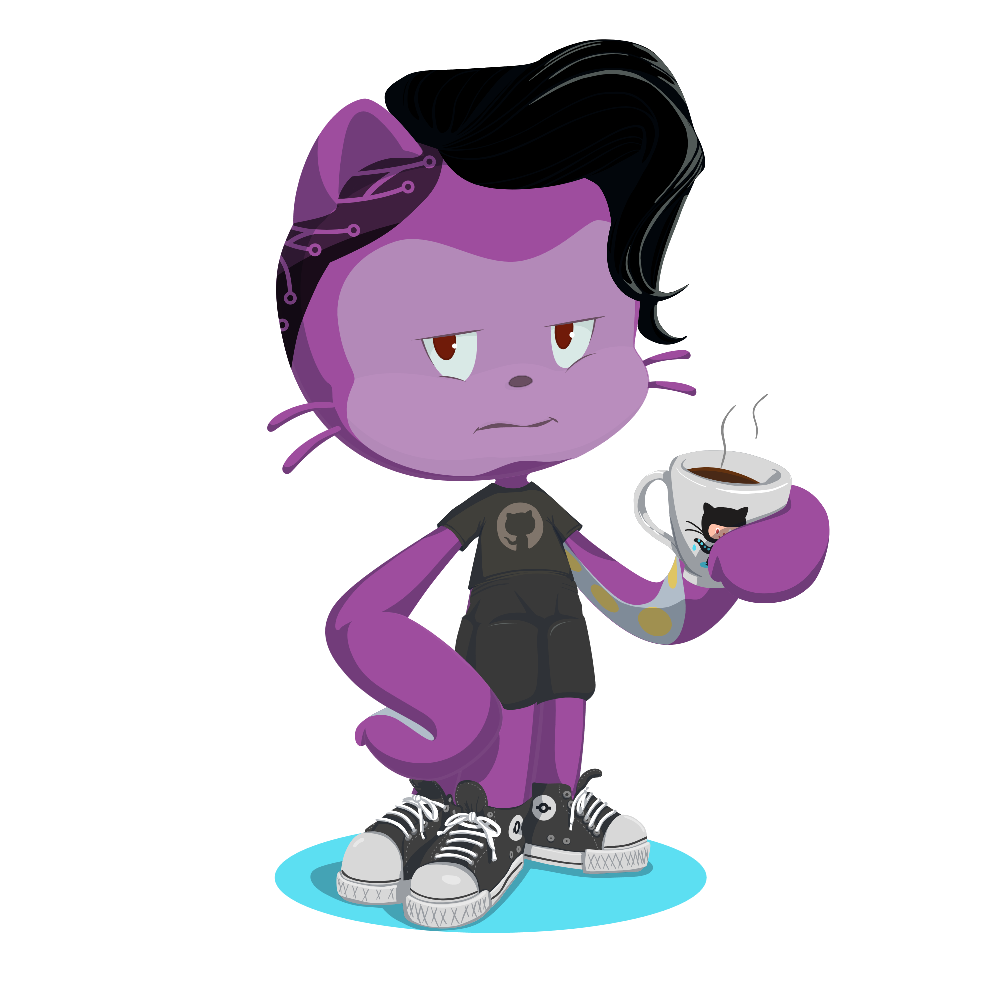

## Hello there 👋

### I'm Illcoron 🏔️

😄 My Pronouns: [All]  
🌱 I’m currently learning **Java**, **C**, **Shell-Scripting**,...  
🏡 H.O.M.E. -- House of Makers and Engineers 
🤝 Cooperation, collaboration and support instead of competition 

 

<!--  -->
<!--
<!--   -->
    
<!--<a href="https://github.com/ryo-ma/github-profile-trophy">-->
    
    

<!--
**Illcoron/Illcoron** is a ✨ _special_ ✨ repository because its `README.md` (this file) appears on your GitHub profile.

Here are some ideas to get you started:

- 🔭 I’m currently working on ...
- 🌱 I’m currently learning ...
- 👯 I’m looking to collaborate on ...
- 🤔 I’m looking for help with ...
- 💬 Ask me about ...
- 📫 How to reach me: ...
- 😄 Pronouns: ...
- ⚡ Fun fact: ...
-->
